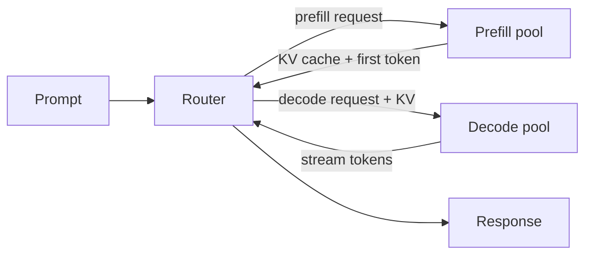

In a typical SGLang deployment, every engine handles both **prefill** (the
one-shot forward over the prompt) and **decode** (the per-token autoregressive
loop). The two phases have different compute profiles:

| Phase | Compute pattern | Bottleneck |
|---|---|---|
| Prefill | Long sequence × full batch | FLOPs |
| Decode | One token × batch | Memory bandwidth |

Mixing them in one engine means each engine is sized for the worse case.
PD disaggregation splits them into two pools, each sized for its own workload.

## Enable

```bash
--prefill-num-servers 2
```

`--prefill-num-servers` is a Miles-native flag added by
`add_prefill_decode_disaggregation_arguments` in `miles/utils/arguments.py`.
When set, `miles/ray/rollout.py` calls
`SglangConfig.from_prefill_num_servers(args)` to dedicate that many SGLang
servers to prefill, with the rest used for decode.

`--prefill-num-servers` is mutually exclusive with the `sglang_config`
attribute (the YAML `server_groups` config), and also cannot be combined
with `--rollout-external` (`arguments.py`).

## When PD is worth it

* Long prompts (≥ 4K). Prefill dominates total latency.
* High decode batch sizes. Decode is memory-bandwidth bound.
* MoE models. Decode benefits disproportionately from EP scaling that prefill
  does not need.

For typical post-training with 1–2K prompts, the routing and KV-transfer
overhead can outweigh the speedup. Measure first.

## How requests flow



The KV cache produced by the prefill pool is migrated to the decode pool.
SGLang handles the cache transfer when the
[SGLang Model Gateway](https://docs.sglang.io/advanced_features/sgl_model_gateway.html)
fronts the engines (PD support is a feature of the SGLang router).

## Sizing the pools

A starting heuristic:

```
prefill_servers = ceil(rollout_qps × avg_prompt_tokens / single_engine_prefill_tps)
decode_servers  = N - prefill_servers
```

Without measurements, start at `prefill_num_servers = N / 4` and adjust based
on observed queueing:

| Symptom | Action |
|---|---|
| Prefill queue backing up | Increase `prefill_num_servers` |
| Decode latency creeping up | Decrease `prefill_num_servers` |
| Both queues growing | Scale up both pools, then revisit the ratio |

## Pairs with

* [DeepSeek R1 recipe](/models/deepseek/deepseek). PD is a clear win at
  671B scale.
* [Speculative decoding](/advanced/speculative-decoding). Both are SGLang-side
  features; pool sizing should account for the verify-batch size when
  speculative is on.

## When PD is not useful

* Short prompts (under ~1K tokens). Prefill is already cheap.
* Single-node setups. Pool boundaries do not help.
* Highly variable workloads. Fixed pool sizes are wasteful.
