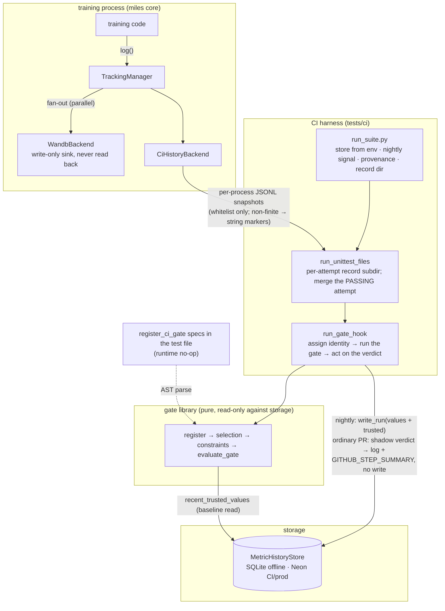
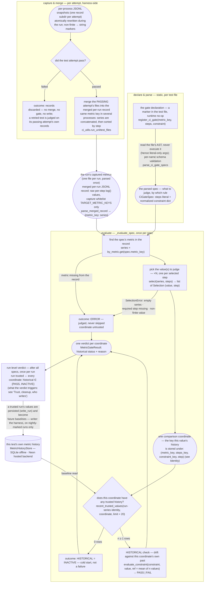

# Metric history & regression gate

CI keeps each test's per-metric numbers from every run in our own store and runs a historical gate against that history — catching the slow drift a single run cannot see. wandb stays a write-only sink; the gate never reads from it. The baseline lives in our DB.

## Identity: what shares a baseline

**Goal:** pin down exactly which past values a new number may be compared against — same test, same metric, same rule, same point — so baselines never mix across meanings.

The gate compares a number only against earlier numbers of the same kind, from the same test. Two keys decide that:

- **Run series** (the "same test"): `(test_path, backend, suite)`. Runs differing on any field never share a baseline. A test-file edit does not reset the series (see Notes).
- **Value within a run**: `(metric_key, steps_key, constraint_key, step)` — the declaring gate's literal content plus which point. `steps_key` and `step` are not redundant: a fanned-out declaration (`steps=[0, 1]` / `steps="all"`) produces several values in one run — one per selected step — and each must be judged only against its own step's history, so the literals identify the spec while `step` identifies the point:
  - `steps_key` / `constraint_key` are canonical JSON of the declaration's raw `steps` / `constraint` literals: no whitespace, dict keys sorted, list order kept as written, a string keyword stored with its JSON quotes — `steps=[0, 1]` → `[0,1]`, `steps="last"` → `"last"` (quotes included). Built from the raw literal, never the normalized form, so a code-side default change can never silently re-key a series; editing the declaration's literals changes these keys, so a declaration edit starts a fresh coordinate history by construction.
  - A field the declaration omitted and the defaults table filled (see Steps & constraint) keys on the **table's** literal — the table entry is the declaration source there, so editing a table entry re-keys every declaration that relied on it: one global reset lever for that standard metric's defaulted baselines, deliberate and heavier than a per-test literal edit.
  - `step` is the point the value came from: step `k` for a per-step value, `-1` for a whole-series reduction (e.g. `steps="last"`) — a reduced value keys on a constant, never the step it happened to land on, or its history would fragment across runs of different lengths.
  - Step-0 `ppo_kl` is compared only against past step-0 `ppo_kl` — never against step 1 or `grad_norm`.

The store's baseline query keys on exactly these (plus a `limit` for how many recent points to read): `recent_trusted_values(test_path, backend, suite, metric_key, steps_key, constraint_key, step, limit)`.

## Steps & constraint: what is compared, and by which rule

**Goal:** let a test declare, as literal data next to its CI registration, which values of a metric are judged and by what rule — validated at parse time, with missing or non-finite data always surfacing as ERROR rather than a silent skip.

A gate declaration composes a step selection and a constraint, both validated at parse time:

- `steps` — which value(s) of the metric's series to compare: `"last"` (the series' last point, a whole-series reduction), `"all"` (every step present), or a list of step indices. `"all"` and a step list fan out to one comparison per step, judged against that step's own history.
- **Constraint** — whether one value passes against a reference: every constraint is two-sided — the value must land in the corridor `[ref − band_down, ref + band_up]`, each side's band written independently as `band = max(rel·|ref|, abs_floor)`; a literal dict of those params (`rel_up` / `abs_floor_up` / `rel_down` / `abs_floor_down`), at least one param per side written. Bands scale from the reference only, so a deviating value cannot widen its own tolerance. There is no unbounded side — a value far from baseline in the "improving" direction is usually a broken metric, and a trusted run's values become future baselines, so admitting it would drag the mean; a side meant to be lenient gets a wide band, not no band.
- **Defaults for standard metrics** — a per-`metric_key` defaults table beside the parser (`GATE_DEFAULTS` in `register.py`) supplies `steps` and `constraint` for the captured standard metrics, so `register_ci_gate(metric_key="train/ppo_kl")` alone is a complete declaration. Each omitted field is filled from the table at parse time, through the same schema validation; an explicitly written literal always wins over its table default, and a metric with no table entry must write both fields. The table's keys stay within the capture whitelist (test-enforced). Band values in the table are shadow-calibration starting points — tuning one re-keys the defaulted coordinates (see Identity), so retunes cost a cold start.

The authoritative constraint params are the schema table beside the function; the doc does not duplicate them. A missing/empty series, a missing required step, or a non-finite value (`NaN` / `±Inf`) at a selected coordinate is an ERROR verdict, never a skip — non-finite is judged here, not silently dropped (capture records it faithfully as a strict-JSON string marker the gate-side reader decodes; `write_run` refuses it at the DB boundary).

A declaration sits at top level of the test file, next to its CI registration — `register_*_ci` decides where the test runs, `register_ci_gate` what is judged after it passes. A gate declaration alone does nothing: an unregistered file is never collected.

```python
from tests.ci.ci_register import register_cuda_ci
from tests.ci.metric_history import register_ci_gate

register_cuda_ci(est_time=300, suite="stage-c-8-gpu-h100")

register_ci_gate(
    metric_key="train/ppo_kl",                     # must be a captured key (whitelist)
    steps=[0, 1],                                  # judge steps 0 and 1, each against its own history
    constraint={"abs_floor_up": 0.02, "rel_down": 0.8, "abs_floor_down": 0.02},
)

register_ci_gate(metric_key="rollout/raw_reward")  # standard metric: steps + constraint from GATE_DEFAULTS
```


## Roles & data flow

**Goal:** split the pipeline into three decoupled roles — collector, harness, gate library — connected only by JSONL files and one store, so the training process never blocks on gating and the gate stays a pure, read-only library.

Three roles, connected only by JSONL files and one DB — there is no long-lived "metrics manager"; the pipeline is per-test, driven by the harness:

- **Collector (training process)** — `miles.utils.tracking_utils.TrackingManager` fans every `log()` out to all enabled backends; `WandbBackend` and `CiHistoryBackend` are parallel siblings in that registry, so wandb receives the same data independently and nothing downstream ever reads it back. `CiHistoryBackend` snapshots the fixed metric whitelist into per-process JSONL files under the harness-assigned record dir (`MILES_CI_GATE_RECORD_DIR`, injected by the CI harness; no CLI flag).
- **Harness / finalizer (CI runner)** — `run_suite.py` builds the store from env (`NEON_DATABASE_URL`, a CI secret), resolves the nightly signal + provenance, and allocates the record dir (CUDA suites only); `ci_utils.run_unittest_files` hands each attempt its own record subdir and merges the PASSING attempt's per-process records into the merged per-run JSONL record (a metric key appearing in several processes gets its series concatenated and sorted by step); `ci_utils.run_gate_hook` then assigns identity, runs the gate, and acts on the verdict.
- **Gate library (pure functions, read-only against storage)** — `register.py` parses `register_ci_gate` declarations out of the test file's AST at evaluation time (the call itself is a runtime no-op; nothing registers at runtime), `selection.py` picks comparison coordinates, `constraints.py` judges pass/fail, `gate.py:evaluate_gate` composes them over the store's baseline read.

One CUDA test run, end to end:




Capture is runtime behavior inside the training process, so it never blocks the run on metric *content*: a non-finite value (`NaN` / `±Inf`) is real evidence of the run and is recorded faithfully, encoded in the JSONL as the string marker `"NaN"` / `"Infinity"` / `"-Infinity"` so every line stays strict JSON (the gate-side reader decodes markers back to floats). Judging non-finite values is the gate's job, not the recorder's. A wrong *type* (non-int/float) is an authoring bug, not run evidence, and still fails loud at capture.

## The gate: drift against trusted history

**Goal:** judge every declared coordinate against its own trusted past, so slow drift gets caught while a fresh baseline can seed itself.

After a test passes, each comparison coordinate's value is judged by its spec's constraint against the coordinate's own history:

- **Historical gate** — activates with ≥1 trusted point at the coordinate. `ref` = mean of the coordinate's trusted values. Catches drift.
- **Cold start** (0 trusted): the gate is inactive — not an error. Zero active checks means the run is vacuously trusted: that is how a fresh baseline gets seeded (recover a poisoned seed via `mark_untrusted`).

A fanned-out spec (`steps="all"` or a step list) contributes one verdict per step; the run is trusted iff **every** coordinate's active checks pass.

The gate's data input is the run's **merged per-run JSONL record**:

- *Merged, per-run*: three processes (the `train.py` driver, the training actor's main rank, the rollout manager) call `init_tracking`, each snapshotting to its own record file. In practice no whitelisted key is logged by more than one of them (today the actor's main rank logs them all), so the merge is a plain union; a key that does appear in several files just gets its series concatenated and step-sorted.
- *JSONL* (JSON Lines): one self-contained JSON line per metric — `{"metric": <key>, "series": [[step, value], ...]}` — each line stands alone, so a process killed mid-run still leaves a parseable record. Capture writes the per-process files, the merge produces this one, and the gate only reads it (`parse_merged_record`, decoding the non-finite string markers back to floats).

How one spec flows from declaration to verdict:




Chart key: rectangle = a step or check; rounded box = a data artifact; diamond = a branch; cylinder = the store. Each check yields one status per coordinate — PASS / FAIL / ERROR / INACTIVE — where INACTIVE arises from a historical cold start. *run-series identity* = `(test_path, backend, suite)`; it and the value coordinate `(metric_key, steps_key, constraint_key, step)` are defined in the Identity section above.

## Storage: two backends, two tables

**Goal:** persist runs and metric values behind one `MetricHistoryStore` contract so gate code stays backend-agnostic (SQLite offline, Neon in CI), with the write boundary guaranteeing only finite values ever enter a baseline.

**Backends** — one `MetricHistoryStore` contract, two implementations; callers see only the contract, and for the same inputs both backends must persist the same run and metric fields, return the same trusted baseline rows in newest-first order, and revoke trust for the same runs:

- `SQLiteMetricHistoryStore` — the local/offline backend, for unit tests and in-process development.
- `NeonMetricHistoryStore` — the hosted Postgres backend, for CI/prod.

**Store API** — the whole contract is three calls:

- `write_run(...)` — persists one CI run: its identity/provenance, its run-level `trusted` flag, and all metric values from that run. It rejects (raises on) non-finite metric values before persisting anything: the DB is the write boundary where validity is enforced, so `NaN` / `±Inf` never enter a baseline — upstream they are gate-side ERROR evidence, not storable measurements.
- `recent_trusted_values(...)` — the historical-gate baseline read: the newest trusted values for one exact run series and one exact value coordinate.
- `mark_untrusted(...)` — flips matching runs to `trusted = false` by `run_id`, `github_run_id`, or `commit_sha`, so the next baseline read excludes those runs without deleting rows.

**Tables & read path**:

- `runs` — one row per CI run of one series: the identity above + provenance (`commit_sha`, `pr_number`, `github_run_id`, `github_run_attempt`, `event_name`, `ref`) + `created_at` + `trusted` (run-level).
- `metric_values` — one row per value: `run_id` FK + `(metric_key, steps_key, constraint_key, step)` + `value`.
- The baseline read is served by the composite index `runs(test_path, backend, suite, trusted, created_at DESC)`.

**Operations** — hosted Postgres setup is out-of-band: the two tables and application role are provisioned outside this repo, and runtime gate code stays DML-only (`NeonMetricHistoryStore` never issues DDL). Old-row cleanup policy is a later operational concern, not part of the M0/M1 substrate.

## Trust, cleanup, who writes

**Goal:** keep the baseline self-protecting — only nightly-marked runs (with recorded provenance) write at all, a nightly run whose metrics fail the gate is still persisted but flagged `trusted = false` so it never enters the baseline, and a point later found bad is revoked by one flag flip instead of deletion.

- A run is `trusted` iff it passed **all** active gates. A drifting run is still recorded, with `trusted = false`, so it can't drag the baseline. A test that fails then passes on **retry** is gated on its passing attempt's metrics and trusted normally — needing a retry is not itself a trust penalty.
- **Clean a bad point**: `mark_untrusted` = `UPDATE runs SET trusted = false` on the run. The next gate read excludes it immediately — no rebaseline, no row deletion.
- **Nightly-marked runs write baselines** — either the `schedule` cron (on `main`, post-merge) **or** a PR carrying the `nightly` label (the PR's own pre-merge code). Provenance (`event_name`, `pr_number`) records which, so a label-PR baseline is distinguishable from a post-merge one and can be `mark_untrusted`'d if it turns out bad. Ordinary (unlabeled) PR runs are read-only and only shadow.
- **What one nightly run writes** — one `runs` row plus one `metric_values` row per value coordinate: two specs sharing a coordinate (identical `steps` + `constraint` literals, differing only in policy metadata) collapse to a single row, so a duplicated declaration cannot double-weight the baseline mean; and a file that declares no gate writes nothing at all — `run_gate_hook` skips the write instead of leaving an empty `runs` row.


## Rollout

**Goal:** land the gate observe-only first, so it accumulates history and proves its verdicts on real runs before any PR can be blocked; enforcement is a later, reversible switch.

Shadow-first: collect, store, and evaluate, but **never block a PR** initially — a historical-gate failure lands as an untrusted row and is surfaced, not enforced. Enforcement arrives later behind a per-test **allowlist** + a global **kill-switch**.

## Notes

**Goal:** record accepted caveats and open questions beside the behavior they qualify; planned-but-unimplemented work lives in TODO below.

- A test-file edit does not reset the series: `test_file_hash` was dropped from the run-series identity because a tiny edit to a test kept wiping its whole history. A test change that genuinely shifts a metric's expected level surfaces as gate failures instead; the reset levers are manual — `mark_untrusted` the stale runs, or edit the declaration literals (new `steps_key` / `constraint_key` ⇒ fresh coordinate).
- The nightly trigger (`schedule` cron + `nightly` label) already shipped (#1491); detection here is harness-side via `GITHUB_EVENT_NAME`, so this feature needs **no** `pr-test.yml` **edit**.
- Open: should a brand-new test's first baselines need human confirmation before counting as trusted? (v1: no.)


## TODO

**Goal:** collect everything planned but not implemented in one place — a doc-first pass must not conform code to this section; current behavior is everything above it.

- **Hard gate returns as a pure absolute bound.** The removed hard layer mixed two motivations that want different judging logic: a sanity check ("from experience this metric must stay below X" — a plain one-sided limit, no tolerance) and a backstop against implicit drift that the historical gate absorbs (e.g. a logp diff growing a little per PR: each run sits within band of a baseline that itself follows the drift). The old implementation fed `hard_ref` through the same band constraint as a reference value (`evaluate_constraint(constraint, value, ref=hard_ref)`), giving a sanity limit tolerance semantics it should not have. Target — two unmixed declaration flavors:
  - `register_ci_gate(...)` without `hard_ref` — the relative check against trusted history, exactly as documented above.
  - `register_ci_gate(..., hard_ref=X)` — a plain absolute bound: the selected value must stay on the right side of `X` (an upper or lower limit), no band, no history involved. `hard_ref` is a limit, never a pinned pseudo-history reference value — synthesizing a baseline from it was considered and rejected as hard to implement. **It will not read any historical data.** `hard_ref` is never filled from the defaults table — an absolute limit is always written explicitly.
  - Baselines survive both the removal and the return: `hard_ref` was policy, never part of the value coordinate, so adding or dropping the absolute flavor never resets a series.
- **Finish the M4 sweep outside `tests/e2e/megatron`** — eligible Megatron CUDA RL-training tests declare the standard one-liners; extend them to the remaining CUDA e2e training tests only for metrics each test's run actually emits (a spec on a metric missing from the record is an ERROR verdict that untrusts every nightly run — a mis-swept test would never accumulate a baseline); each test owner tunes or vetoes their line in review.
- **Capture set becomes** `TARGET_METRIC_KEYS` **∪ declared keys** — the harness parses specs pre-launch and injects the extras via env.
- **Self-calibrating constraint** — band = k·std of the coordinate's own history, for heteroskedastic tests; and a `mean` (step-average) reduction.
- **Enforcement** — the per-test allowlist + global kill-switch from Rollout; shadow mode is current behavior.
