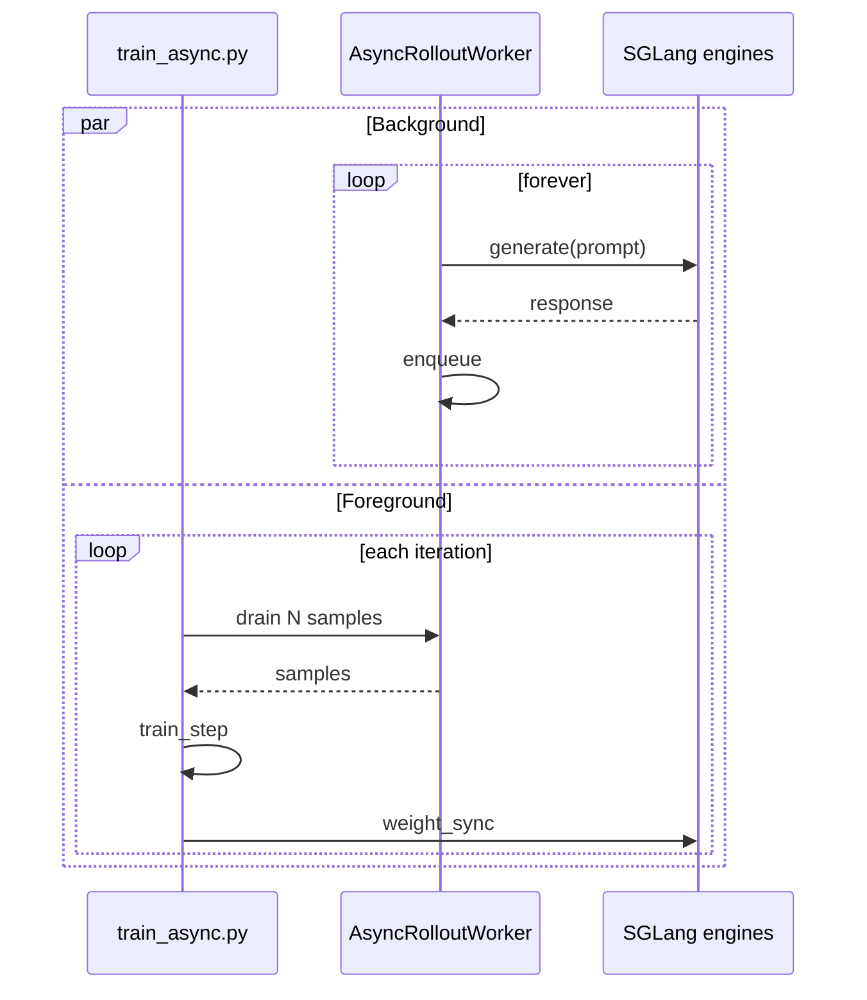

**What you'll learn:** how to make rollout production and trainer consumption fully
parallel, with a queue in between, by using a custom rollout function.

In the default training loop, every iteration looks like:

```text
for it in range(N):
    prompts   = sample()        # cheap
    responses = generate()      # 10-30s
    rewards   = score()         # 1-3s
    loss      = train_step()    # 5-20s
    sync_weights()              # 1-10s
```

`generate()` blocks `train_step()`. With Async Rollout the loop is split: a background
thread runs `generate` continuously, and the trainer drains a queue. The two run in
parallel and the wall-clock time per iteration drops to roughly `max(generate, train)`
instead of the sum.

## Prerequisites

* You completed the [Qwen3-4B](/models/qwen/qwen3) recipe (or have an
  equivalent model + dataset).
* Comfortable with [Customization](/user-guide/customization) — async rollout uses
  a custom rollout function.

## Files

```text
examples/fully_async/
├── fully_async_rollout.py          # AsyncRolloutWorker + entry function
├── run-qwen3-4b-fully_async.sh     # launch script (Qwen3-4B)
└── run_qwen3_30b_a3b_fully_async.py # MoE variant
```

## Quick start

```bash
cd /root/miles
bash examples/fully_async/run-qwen3-4b-fully_async.sh
```

You should see:

```text
Creating new global async worker...
Continuous async rollout worker started
[trainer] iter 1/3000 | drained 32 samples (queued: 18)
```

## What changes vs. the default recipe

Just two flags:

```diff
- python3 train.py ...
+ python3 train_async.py ...
+   --rollout-function-path fully_async_rollout.generate_rollout_fully_async
```

Everything else — model args, optimizer, GRPO config — stays the same.

## Walkthrough

The interesting code is small. Here's the global worker manager:

```python fully_async_rollout.py
_global_worker = None
_worker_lock = threading.Lock()

def get_global_worker(args, data_buffer):
    global _global_worker
    with _worker_lock:
        if _global_worker is None or not _global_worker.worker_thread.is_alive():
            print("Creating new global async worker...")
            _global_worker = AsyncRolloutWorker(args, data_buffer,
                                                concurrency=args.sglang_server_concurrency)
            _global_worker.start()
        return _global_worker
```

Key points:

* **Singleton.** One worker per process — multiple `train.py` calls share it.
* **Thread + asyncio loop.** Cheaper than a subprocess; SGLang HTTP calls are I/O-bound,
  so an asyncio loop in a single thread saturates them.
* **`atexit` hook.** Worker is torn down when the process exits — no orphaned
  generation tasks.

The worker itself keeps `--rollout-batch-size` tasks in flight using
`generate_and_rm_group`:

```python
async def _producer(self):
    while not self._stop:
        if len(self._inflight) < self.target_inflight:
            self._inflight.add(asyncio.create_task(self._launch_one()))
        done, self._inflight = await asyncio.wait(
            self._inflight, return_when=asyncio.FIRST_COMPLETED
        )
        for task in done:
            self._output_queue.put(task.result())
```

And the trainer-side entry simply drains:

```python
async def generate_rollout_fully_async(args, rollout_id, *, evaluation=False):
    worker = get_global_worker(args, data_buffer)
    samples = []
    while len(samples) < args.global_batch_size:
        samples.append(worker._output_queue.get(timeout=600))
    return RolloutFnTrainOutput(samples=samples)
```

## What's happening underneath



The producer loop is decoupled from the consumer loop. As long as the queue stays
populated, the trainer never blocks on generation.

## Tuning knobs

| Knob | Effect |
|---|---|
| `--rollout-batch-size` | Worker target in-flight count |
| `--sglang-server-concurrency` | Per-engine concurrency cap |
| `--num-steps-per-rollout` | Increase to consume more per drain (off-policy) |

If queue depth grows unbounded, training is slower than rollout — bump
`--num-steps-per-rollout` (you'll be slightly off-policy) or scale up trainer
parallelism.

If queue depth stays at 0, rollout is the bottleneck — that's where async helps least
because there's nothing waiting to be consumed.

## What to watch

```text
async/queue_depth                 stable (50-200 typical)
async/producer_throughput_qps     consistent
async/consumer_drain_seconds      < producer cycle time
```

If `consumer_drain_seconds > producer_cycle_time`, your trainer is starving the queue —
check GPU utilization.

## Limitations

* **No evaluation mode in this example.** Eval still runs through the synchronous path
  in `train_async.py`. Adding async eval is straightforward — copy the worker pattern
  and use `evaluation=True`.
* **Best-effort ordering.** Samples are sorted by index at drain time, but exact-order
  guarantees aren't provided.
* **Minimal error handling.** If a generate task throws, it's logged but the worker
  keeps going. Production users wire in [fault tolerance](/advanced/fault-tolerance).

## Variations

### Async on a 30 B MoE

`run_qwen3_30b_a3b_fully_async.py` shows the same pattern with `tp=4 ep=8` and
`--sglang-enable-ep-moe`. The only practical difference is increasing
`--rollout-batch-size` to 64+ to keep the larger engine pool fed.

### Async + R3

Async rollout and R3 stack cleanly. Add:

```bash
GRPO_ARGS+=( --use-rollout-routing-replay )
```

The custom rollout function automatically passes `return_routed_experts=true` because
it uses `generate_and_rm_group` under the hood.

### Async + partial rollout

If you also use `--partial-rollout`, half-finished trajectories are saved to disk and
resumed — useful when the worker is killed mid-flight.
