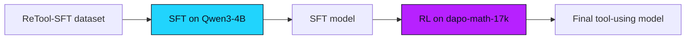

**What you'll learn:** the full SFT → RL pipeline for tool-augmented reasoning, with
sandboxed Python execution and a reward function that checks both the final answer and
the tool-use trace.

This is the canonical example for teaching a model to **think with code** — write a
Python snippet, get the result, continue reasoning, repeat.

## Prerequisites

* Familiar with [Search-R1](/examples/search-r1) — same general pattern.
* `radixark/miles:latest` container.
* ~150 GB free disk for the SFT data + base model.

## Files

```text
examples/retool/
├── generate_with_retool.py      # multi-turn rollout with code-interpreter
├── tool_sandbox.py              # sandboxed Python execution
├── sft_data_processing.py       # SFT data prep
├── rl_data_preprocess.py        # RL data prep
├── retool_qwen3_4b_sft.sh       # SFT launch
└── retool_qwen3_4b_rl.sh        # RL launch
```

## The pipeline



You can skip the SFT phase by using the pre-trained checkpoint we publish:
`font-info/qwen3-4b-sft-SGLang-RL`.

## Quick start (RL only)

```bash
hf download font-info/qwen3-4b-sft-SGLang-RL --local-dir /root/font-info/qwen3-4b-sft
hf download --repo-type dataset BytedTsinghua-SIA/DAPO-Math-17K --local-dir /root/dapo-math-17k
hf download --repo-type dataset zhuzilin/aime-2024     --local-dir /root/aime-2024

# 2. Convert
cd /root/miles
source scripts/models/qwen3-4B.sh
PYTHONPATH=/root/Megatron-LM python tools/convert_hf_to_torch_dist.py \
   ${MODEL_ARGS[@]} \
   --hf-checkpoint /root/font-info/qwen3-4b-sft \
   --rotary-base 5000000 \
   --save           /root/font-info/qwen3-4b-sft_torch_dist

# 3. Run
bash examples/retool/retool_qwen3_4b_rl.sh
```

## Full pipeline (SFT then RL)

```bash
# 0. Download SFT data + base model
hf download --repo-type dataset JoeYing/ReTool-SFT --local-dir /root/JoeYing/ReTool-SFT
hf download Qwen/Qwen3-4B-Instruct-2507            --local-dir /root/Qwen/Qwen3-4B-Instruct-2507

# 1. Convert (note the non-default rotary base)
source scripts/models/qwen3-4B.sh
PYTHONPATH=/root/Megatron-LM python tools/convert_hf_to_torch_dist.py \
   ${MODEL_ARGS[@]} \
   --hf-checkpoint /root/Qwen/Qwen3-4B-Instruct-2507 \
   --rotary-base 5000000 \
   --save           /root/Qwen/Qwen3-4B-Instruct-2507_torch_dist

# 2. SFT data prep + run
python examples/retool/sft_data_processing.py
bash examples/retool/retool_qwen3_4b_sft.sh

# 3. RL (uses output of SFT)
bash examples/retool/retool_qwen3_4b_rl.sh
```

<Warning>

**rotary-base 5000000.** Qwen3-4B-Instruct-2507 ships with `rotary_base=5_000_000`. If you forget the
`--rotary-base 5000000` override during conversion, you'll see garbled generations
that look like the model has been lobotomized. Don't skip it.

</Warning>

## Walkthrough — tool format

The model is taught a strict tool-call grammar:

```text
You may call one or more functions to assist with the user query.

You are provided with function signatures within <tools></tools> XML tags:
<tools>
{"type": "function", "function": {
  "name": "code_interpreter",
  "description": "A tool for executing code.",
  "parameters": {"type": "object", "properties": {
    "code": {"type": "string", "description": "The code to execute."}
  }, "required": ["code"]}
}}
</tools>

For each function call, return a json object with function name and arguments
within <tool_call></tool_call> XML tags:
<tool_call>
{"name": "code_interpreter", "arguments": {"code": "print(2+2)"}}
</tool_call>
```

Output from the interpreter is fed back as `<tool_response>...</tool_response>` and
masked out of the loss.

## Walkthrough — sandbox

`tool_sandbox.py` keeps execution **boring** — Python, no shell, restricted modules,
hard memory + time caps. Defaults live in a module-level `TOOL_CONFIGS` dict, and the
executor is `PythonSandbox`:

```python
TOOL_CONFIGS = {
    "python_timeout": 120,         # seconds
    "python_memory_limit": "4GB",
    "tool_concurrency": 32,
    # ...
}

class PythonSandbox:
    def __init__(self, timeout: int = 10, memory_limit: str = "100MB"):
        self.timeout = timeout
        self.memory_limit = memory_limit
        self.allowed_modules = {"math", "random", "datetime", "collections",
                                "itertools", "functools", "operator",
                                "statistics", "decimal", "fractions"}

    async def execute_code(self, code: str) -> str:
        ...
```

Every execution runs in its own subprocess. If you need a richer sandbox (network,
filesystem), swap in a container-based runner — the interface is just
`PythonSandbox.execute_code(code) -> str`.

## Walkthrough — reward

```python
async def reward_func(args, sample, **kwargs):
    parsed = parse_trace(sample.response)
    correct = check_answer(parsed.final_answer, sample.label)

    # 1. Final answer (most weight)
    r_ans = 1.0 if correct else 0.0

    # 2. Format bonus
    r_fmt = 0.1 if parsed.has_valid_format else 0.0

    # 3. Tool-use bonus (small, just to encourage tool calls)
    r_use = 0.05 if parsed.num_tool_calls > 0 else 0.0

    return r_ans + r_fmt + r_use
```

The shaping rewards are deliberately small. The dominant signal is correctness — the
shape and tool use just keep gradient alive in the early epochs.

## Tuning knobs

| Knob | Effect |
|---|---|
| `TOOL_CONFIGS["python_memory_limit"]` | Sandbox per-call memory |
| `TOOL_CONFIGS["python_timeout"]` | Sandbox per-call wallclock |
| `PythonSandbox.allowed_modules` | What modules the model can import |
| `--rollout-max-response-len` | Total response cap (incl. tool I/O) |
| `format / tool-use bonus weights` | How aggressively to shape early |

## What to watch

```text
retool/tool_calls_per_sample          1.5 – 3.0
retool/tool_success_rate              > 0.85
retool/avg_code_length_chars          50 – 200
reward/exact_match                    trending up
reward/format_bonus                   ~0.10
sandbox/timeout_rate                  < 0.02
```

If `sandbox/timeout_rate` climbs, the model is generating expensive code. Either bump
`TOOL_CONFIGS["python_timeout"]` or restrict `PythonSandbox.allowed_modules` (numpy is
the usual suspect).

## Troubleshooting

| Problem | Fix |
|---|---|
| `ModuleNotFoundError` from sandbox | Add the module to `PythonSandbox.allowed_modules` |
| Tool response not masked | Check `<tool_response>` boundary regex matches your output |
| EM = 0 forever | Verify your answer extractor — check a few samples manually |
| Sandbox returns `MemoryError` | Bump `TOOL_CONFIGS["python_memory_limit"]`, or restrict `numpy` calls |

## Variations

* **Use a different tool.** Replace the sandbox with shell, search, calculator, or any
  other function. The grammar in `<tool_call>` is the only contract.
* **Multiple tools.** Add more entries to the `<tools>` block — the model picks per
  call.
* **Skip SFT.** The pre-SFT'd model is published; for many tasks the RL phase alone is
  enough.
* **GRPO with multiple trajectories.** `--n-samples-per-prompt 8` works as expected;
  each trajectory has its own tool-execution trace.
