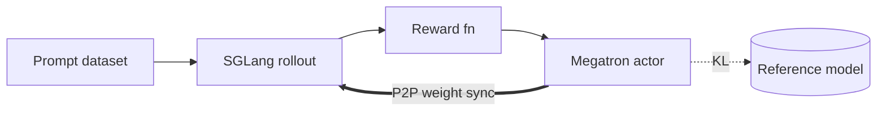

This page takes you from `docker pull` to a running GRPO training job on Qwen3-4B. It
assumes an 8-GPU node (H100 / H200 / B-series) and roughly 200 GB of disk.

For other models, see [Models](/models/index).

## 1. Start the container

On the **host**:

```bash
docker pull radixark/miles:latest
docker run --rm \
  --gpus all --ipc=host --shm-size=32g \
  --ulimit memlock=-1 --ulimit stack=67108864 \
  --network=host \
  -it radixark/miles:latest /bin/bash
```

That drops you into a shell inside the container. Refresh the editable install:

```bash
cd /root/miles && git pull && pip install -e . --no-deps
```

Steps 2–4 below all run inside the container.

## 2. Download model and data

```bash
hf download Qwen/Qwen3-4B                          --local-dir /root/Qwen3-4B
hf download --repo-type dataset BytedTsinghua-SIA/DAPO-Math-17K --local-dir /root/dapo-math-17k
hf download --repo-type dataset zhuzilin/aime-2024     --local-dir /root/aime-2024
```

## 3. Convert to Megatron format

Megatron consumes a `torch_dist` checkpoint, not the raw HuggingFace directory.

```bash
cd /root/miles
source scripts/models/qwen3-4B.sh

PYTHONPATH=/root/Megatron-LM python tools/convert_hf_to_torch_dist.py \
   ${MODEL_ARGS[@]} \
   --hf-checkpoint /root/Qwen3-4B \
   --save          /root/Qwen3-4B_torch_dist
```

For larger models, run the converter under `torchrun --nproc-per-node 8` (optionally
multi-node). See the [Models](/models/index) section for per-family conversion
commands.

## 4. Launch training

```bash
bash scripts/run-qwen3-4B.sh
```

The script starts Ray, launches SGLang engines, loads the Megatron actor, and runs the
rollout / train loop. After a minute or two you should see iteration logs:

```text
[ray]      starting cluster on 1 node, 8 gpus
[sglang]   launching 4 engines (tp=2 each)
[megatron] loading dist checkpoint from /root/Qwen3-4B_torch_dist
[trainer]  iter 1/3000 | loss=0.412 reward=0.61 rollout=18.4s train=22.1s
```

## 5. What's happening

Each iteration runs the same four steps:



1. Sample `rollout-batch-size` prompts and generate `n-samples-per-prompt` responses.
2. Score responses with the reward model (`--rm-type deepscaler` in this recipe).
3. Compute the GRPO objective and step the optimizer.
4. Push updated weights back to the SGLang engines via P2P.

The four batch-sizing knobs satisfy:

```
rollout_batch_size × n_samples_per_prompt
  = global_batch_size × num_steps_per_rollout
```

Miles fills in whichever side you leave unset.

## Inspecting a run

| Question | Where to look |
|---|---|
| Is the policy learning? | `loss` and `reward` columns in stdout, or wandb |
| Rollout or train bottleneck? | `rollout=` vs. `train=` timings per iteration |
| Are GPUs saturated? | `nvidia-smi dmon -s u` |
| SGLang internals? | `tail -f /tmp/sglang/*.log` |
| Ranks crashing? | `~/.ray/session_latest/logs/worker-*.err` |

## Next steps

- [Core concepts](/user-guide/concepts) — the model behind rollout / actor / reference.
- [Training script walkthrough](/user-guide/training-script-walkthrough) —
  an annotated tour through every argument group in a launch script, plus colocation,
  dynamic sampling, partial rollout, and BF16+FP8 inference.
- [Training backends](/user-guide/usage) — Megatron vs FSDP.
- [Customization](/user-guide/customization) — plug in custom rollout / reward.
- [Models](/models/index) — recipes for Qwen3.5, GLM4.5, DeepSeek R1, Kimi K2, and more.

If you hit issues, the [FAQ](/faq) covers the common ones.
