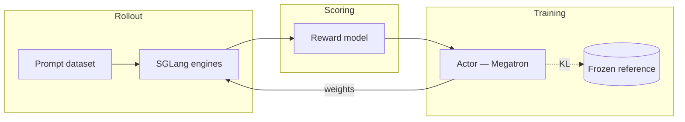

A Miles training job is a loop over four objects. Once you understand what each one
*is* and how data flows between them, every flag in the system has an obvious home.

## The four objects



| Object | Role | Lives in |
|---|---|---|
| **Prompt dataset** | Source of input examples | JSONL on disk (or `--data-source-path`) |
| **Rollout (SGLang engines)** | Generates responses given prompts | One or more SGLang servers behind a router |
| **Reward model** | Maps `(prompt, response, label) → score` | Built-in (`--rm-type`) or custom (`--custom-rm-path`) |
| **Actor (Megatron / FSDP)** | The model being trained | Megatron `torch_dist` checkpoint, or HF directory under FSDP |
| **Reference** | Frozen copy of the actor for KL anchoring | Loaded from `--ref-load`, never updated |

## The training loop

```python
for it in range(num_rollout):
    # 1. Sample
    prompts   = dataset.sample(rollout_batch_size)
    responses = sglang.generate(prompts, n=n_samples_per_prompt)

    # 2. Score
    rewards   = reward_fn(prompts, responses, labels)

    # 3. Optimize
    for step in range(num_steps_per_rollout):
        batch = pack(prompts, responses, rewards, size=global_batch_size)
        loss  = grpo_loss(actor, ref_model, batch)
        loss.backward(); optimizer.step()

    # 4. Sync
    p2p_weight_transfer(actor → sglang_engines)
```

That's the whole thing. Every flag in Miles configures one of these four steps.

## The four-knob invariant

Two knobs govern the sampling half of the loop, two govern the training half, and they
are locked into a single equation:

```
rollout_batch_size × n_samples_per_prompt
  = global_batch_size × num_steps_per_rollout
```

**Every sample produced by rollout is consumed by training, and every sample consumed
by training was produced by rollout.** Set any three sides; Miles fills in the fourth.
Set all four inconsistently and Miles aborts with a validation error.

## Where every flag goes

Use this map when reading any launch script:

| Argument group | Concerns |
|---|---|
| [`MODEL_ARGS`](/user-guide/argument-groups#model-args) | Architecture constants (layers, hidden size, rotary base, ...) |
| [`CKPT_ARGS`](/user-guide/argument-groups#ckpt-args) | Filesystem paths for the actor / reference / save directory |
| [`ROLLOUT_ARGS`](/user-guide/argument-groups#rollout-args) | Prompt dataset, batch knobs, sampling parameters, reward type |
| [`EVAL_ARGS`](/user-guide/argument-groups#eval-args) | Eval dataset, cadence, sampling overrides for evaluation |
| [`PERF_ARGS`](/user-guide/argument-groups#perf-args) | Parallelism (TP/PP/CP/EP/ETP), recomputation, dynamic batching |
| [`GRPO_ARGS`](/user-guide/argument-groups#grpo-args) | RL algorithm, KL, clipping, entropy bonus, advantage estimator |
| [`OPTIMIZER_ARGS`](/user-guide/argument-groups#optimizer-args) | Learning rate, schedule, weight decay, Adam betas |
| [`SGLANG_ARGS`](/user-guide/argument-groups#sglang-args) | Engine TP, memory fraction, log level, `--sglang-*` passthrough |

## Next

- [Training Backend](/user-guide/usage) — Megatron-LM, parallelism, checkpoints, and hooks.
- [Argument Groups](/user-guide/argument-groups) — where each launch-script array belongs.
- [Training Script Walkthrough](/user-guide/training-script-walkthrough) — the launch script
  group by group, plus execution modes (colocation, sync/async, dynamic sampling, …).
- [CLI Reference](/user-guide/cli-reference) — every flag, grouped and fully catalogd.
