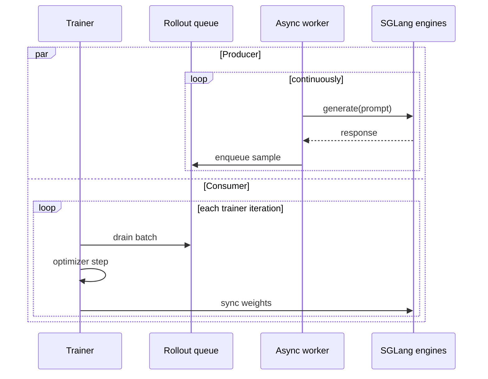

Fully async rollout splits Miles into two concurrent loops:

1. A background rollout worker keeps SGLang generation in flight and pushes completed
   samples into a queue.
2. The trainer drains the queue, runs optimizer steps, and syncs updated weights back
   to rollout engines.

When rollout and training take similar time, per-iteration wall time moves from
`rollout_time + train_time` toward `max(rollout_time, train_time)`.

## When to use it

| Use fully async when | Stay synchronous when |
|---|---|
| Rollout is a large part of wall time | Debugging a new recipe |
| The run is long enough to amortize queue warm-up | You need the strictest possible on-policy cadence |
| SGLang engines can keep many requests in flight | Queue depth stays at zero even after tuning concurrency |
| You can tolerate slightly older samples in exchange for throughput | You are validating loss math or reward plumbing |

The mode is especially useful for long-context math, tool-use, and agentic workloads
where generation dominates the iteration.

## Enable it

Switch the entrypoint from `train.py` to `train_async.py` and provide a rollout
function that owns the background worker:

```diff
- python3 train.py ...
+ python3 train_async.py ...
+   --rollout-function-path fully_async_rollout.generate_rollout_fully_async
```

Everything else belongs in the same [argument groups](/user-guide/argument-groups) as a
synchronous run.

## Queue model



The queue is the contract. If it stays populated, the trainer does not wait for
generation. If it is empty, rollout is still the bottleneck and async cannot hide it.

## Tuning knobs

| Knob | What it changes |
|---|---|
| `--rollout-batch-size` | Target amount of work the async producer keeps in flight |
| `--sglang-server-concurrency` | Per-engine request concurrency |
| `--global-batch-size` | Number of samples the trainer drains per step |
| `--num-steps-per-rollout` | Number of optimizer steps per queue drain cycle |
| `--max-weight-staleness` | When the rollout engine's weight version lags the trainer's by more than this, the worker recycles the stale group instead of feeding it to the loss |

The reference worker caps its output queue at 1000 groups, so if training is slower
than rollout the producer eventually blocks rather than growing the queue without
bound. If the queue stays at zero, rollout is the bottleneck — scale rollout capacity
or lower per-sample generation cost.

## What to monitor

The reference worker logs progress to stdout, not wandb. Useful lines to grep for:

```text
Global worker queue size: <N>
Staleness stats: recycled=<N>, avg_staleness=<f>, max_staleness=<N>
Warning: No progress for <N>s. Queue size: <N>, Collected: <N>/<N>
```

Treat large staleness windows as a training-quality signal, not just a performance
signal. Fast [P2P weight transfer](/advanced/p2p-weight-transfer) keeps the
rollout engines closer to the latest actor weights so fewer groups get recycled by
`--max-weight-staleness`.

## Example implementation

For a complete Qwen3 launch script and worker implementation, see the
[Fully Async Rollout example](/examples/fully-async).
